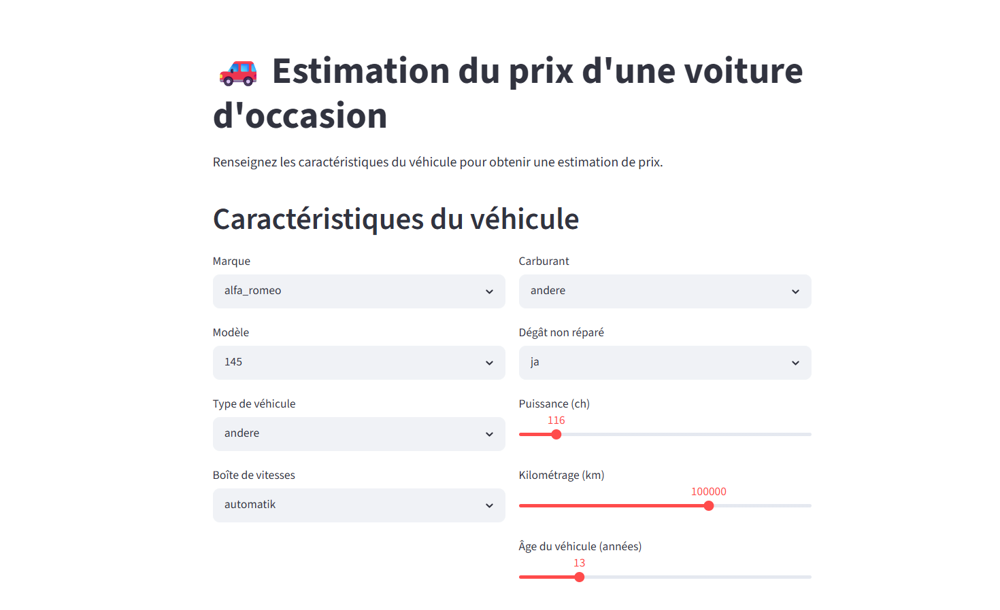
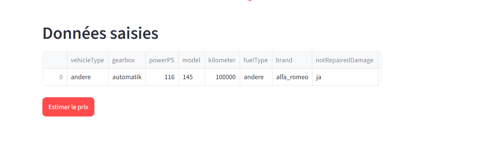
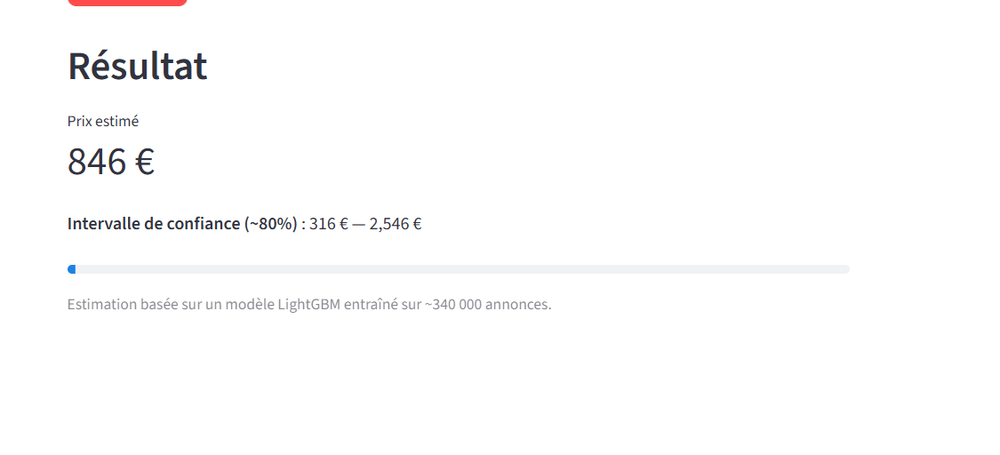

# Prédiction du prix d'une voiture d'occasion

Projet du Module 5 — Machine Learning

##  Application déployée

 [Accéder à l'application](https://mlprojectcarpriceprediction-59nbw8rhsjxxcdslrappcfa.streamlit.app/)

##  Description du projet

Ce projet met en œuvre un pipeline de Machine Learning complet pour prédire
le prix de vente d'une voiture d'occasion à partir de ses caractéristiques
(marque, modèle, âge, kilométrage, puissance, type de carburant, etc.).

Il s'agit d'un problème de **régression supervisée**. Le jeu de données
contient environ 371 000 annonces de voitures d'occasion. Après nettoyage,
plus de 340 000 annonces ont servi à l'entraînement.

**Cible :** prix de la voiture (en euros)

## 🗂️ Données

- Source : annonces de voitures d'occasion (marché allemand, 2016)
- ~371 000 lignes brutes, ~343 000 après nettoyage
- Variables : type de véhicule, boîte de vitesses, puissance, modèle,
  kilométrage, carburant, marque, dégâts non réparés, âge

## ⚙️ Pipeline ML

1. **EDA** : analyse des distributions, corrélations, détection des valeurs aberrantes
2. **Préprocessing** : nettoyage des outliers, imputation des valeurs manquantes,
   encodage One-Hot, normalisation, transformation logarithmique de la cible
3. **Modélisation** : 11 algorithmes testés (régression linéaire, Ridge, Lasso,
   KNN, arbres, Random Forest, XGBoost, LightGBM…)
4. **Tuning** : optimisation des 3 meilleurs modèles (RandomizedSearchCV)
5. **Modèle final** : LightGBM (R² ≈ 0.85, erreur moyenne ≈ 1 250 €)
6. **Déploiement** : application Streamlit avec intervalle de confiance

## 📊 Résultats du modèle final (LightGBM)

| Métrique | Valeur |
|----------|--------|
| MAE | ≈ 1 250 € |
| RMSE | ≈ 3 070 € |
| R² (test) | ≈ 0.85 |

## 🖥️ Captures d'écran

### Saisie des caractéristiques

### Données saisies

### Résultat de l'estimation

## 📁 Structure du dépôt

- `app.py` — application Streamlit
- `notebook.ipynb` — notebook complet (EDA, modélisation, évaluation)
- `model_pipeline.joblib` — pipeline sérialisé (préprocessing + modèle)
- `app_options.joblib` — options des menus de l'application
- `requirements.txt` — dépendances
- `rapport.pdf` — rapport détaillé du projet

## 🛠️ Technologies

Python, pandas, scikit-learn, LightGBM, XGBoost, Streamlit, joblib

